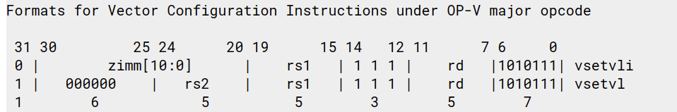

# How to execute one instruction

content

- How to generate the instruction class
- Inheritance between instruction classes

## get code

```
$ git clone -b develop git@github.com:RALC88/gem5.git
$ cd gem5
$ git reset 1339a1b0801431
```

new: 60c0e02f7d9c1e42c95173e5f9373a56df234c98

base: 1339a1b08014311d4fd443d9a26b632a2438d7f7


## parser and generate

The gem5 ISA description language is a custom language designed specifically for generating the class definitions and decoder function needed by gem5.

An ISA description file is divided into two parts.

- declarations section: defines the global information (classes, instruction formats, templates, etc.) required to support the decoder.
- decode section: specifies the structure of the decoder and defines the specific instructions returned by the decoder.

### decode and declaration

A decode block specifies a field of a machine instruction to decode and the result to be provided for particular values of that field.

EXAMPLE

`vsetvl` instruction format



Just like C switch statement
```c++
// ./src/arch/riscv/isa/decoder.isa
decode QUADRANT {
    0x3: decode OPCODE {
        0x15: decode VFUNC_6 {
            0x20: decode FUNCT3 {
                0x7: VectorConfigOp::vsetvl();
            }
        }
    }
}
```

Use the declaration in bitfields.isa
```
// ./src/arch/riscv/isa/bitfields.isa

def bitfield QUADRANT <1:0>;                   // 0x3
def bitfield OPCODE <6:2>;                     // 0x15
def bitfield VFUNC_6       <31:26>;            // 0x20
def bitfield FUNCT3 <14:12>;                   // 0x7
```

VectorConfigOp

```python
// ./src/arch/riscv/isa/formats/vector.isa

def format VectorConfigOp( *vecflags) {{
    iop = InstObjParams(name, Name, 'RiscvVectorCfgOp', vecflags)
    header_output = BasicDeclare.subst(iop)
    decoder_output = VectorConfigConstructor.subst(iop)
    decode_block = BasicDecode.subst(iop)
    exec_output = VectorExecute.subst(iop)
}};
```

The format code block specifies the generated code by assigning strings to four special variables: header_output, decoder_output, exec_output, and decode_block.

- iop: Instances of the InstObjParams class, constructor arguments: mnemonic, class_name, and base_class. In this context, mnemonic is `vsetvl`, class_name is `Vsetvl`.
Encapsulate all of the parameters needed to substitute into a code template, to be used as the argument to a template’s subst() method

```python
def template VectorConfigConstructor {{
    %(class_name)s::%(class_name)s(MachInst machInst)
        : %(base_class)s("%(mnemonic)s", machInst, VectorConfigOp)
    {
        %(constructor)s;
        flags[IsVector] = true;
        //vecflags[IsVecConfigOp] = true;
    }
}};
```

```python
// Basic instruction class execute method template.
def template VectorExecute {{
    Fault
    %(class_name)s::execute(ExecContext *xc,
        Trace::InstRecord *traceData) const
    {
        panic("Vector instruction had it's execute() called!");
        return NoFault;
    }
}};
```

### generated code

We could build in `build_v` dir instead of `build_epi01 build_epi02 build_epi03 build_test_lmul build_rva build_develop build` which belongs to `.gitignore` to search generated code for one instruction.

```bash
$ mkdir build_v && cd build_v
$ scons -j9 build/RISCV/gem5.opt
```

Then search `vsetvl` to get generated code.

```c++
// ./build_v/RISCV/arch/riscv/generated/decode-method.cc.inc
decode QUADRANT {
    0x3: decode OPCODE {
        0x15: decode VFUNC_6 {
            0x20: decode FUNCT3 {
                0x7: {
                    // VectorConfigOp::vsetvl(([], {}))
                    return new Vsetvl(machInst);
                    break;
            }
        }
    }
}
```

Just return a `Vsetvl` class pointer.

```c++
// ./build_v/RISCV/arch/riscv/generated/decoder-ns.hh.inc
// VectorConfigOp::vsetvl(([], {}))

    //
    // Static instruction class for "vsetvl".
    //
    class Vsetvl : public RiscvVectorCfgOp
    {
      public:
        /// Constructor.
        Vsetvl(MachInst machInst);
        Fault execute(ExecContext *, Trace::InstRecord *) const override;
        using RiscvVectorCfgOp::generateDisassembly;
    };
```

```c++
// VectorConfigOp::vsetvl(([], {}))

    Fault
    Vsetvl::execute(ExecContext *xc,
        Trace::InstRecord *traceData) const
    {
        panic("Vector instruction had it's execute() called!");
        return NoFault;
    }
```

```c++
// VectorConfigOp::vsetvl(([], {}))

    Vsetvl::Vsetvl(MachInst machInst)
        : RiscvVectorCfgOp("vsetvl", machInst, VectorConfigOp)
    {
        
	_numSrcRegs = 0;
	_numDestRegs = 0;
	_numFPDestRegs = 0;
	_numVecDestRegs = 0;
	_numVecElemDestRegs = 0;
	_numVecPredDestRegs = 0;
	_numIntDestRegs = 0;
	_numCCDestRegs = 0;;
        flags[IsVector] = true;
        //vecflags[IsVecConfigOp] = true;
    }
```

## execute

Now we have a class `Vsetvl` inherits class `RiscvVectorCfgOp`.

`RiscvVectorCfgOp` just like `RiscvVectorDataOp`, `RiscvVectorMemOp` and so on inherits class `RiscvVectorInsn`, just add `generateDisassembly` function.

```c++
class RiscvVectorToScalarOp : public RiscvVectorInsn
    {
        std::string generateDisassembly(Addr pc,
            const Loader::SymbolTable *symtab) const;
    };
```

`RiscvVectorInsn` inherits class `VectorStaticInst`, just add instruction name, 32 bits instruction and other helper function to get v instruction features.

```c++
class RiscvVectorInsn : public VectorStaticInst
{
  uint32_t opcode()          const { return x(0, 7); }

  uint32_t vtype()           const  override   { return x(20, 11); }

  uint32_t func3()           const override { return x(12, 3); }
  uint32_t func5()           const override { return x(27, 5); }
  uint32_t func6()           const override { return x(26, 6); }

  bool vm()                  const  override   { return x(25, 1); }

  uint8_t mop()              const override { return x(26, 3); }

  RegIndex vs1()             const override { return (RegIndex)x(15, 5); }
  RegIndex vs2()             const override { return (RegIndex)x(20, 5); }
  RegIndex vs3()             const override { return (RegIndex)x(7, 5); }
  RegIndex vd()              const override { return (RegIndex)x(7, 5); }

  bool isFP()                const  override   { return ((func3()==1) || (func3()==5)) && !isConvert(); }
  bool isInt()               const  override   { return ((func3()==0) || (func3()==2) || (func3()==3) || (func3()==4) || (func3()==6)) && !is_slide(); }
  bool isConvert()           const override { return isConvertIntToFP() || isConvertFPToInt(); }
  bool is_slide()            const override { return is_slideup() || is_slidedown() ; }

  bool VectorToScalar()      const override { return opClass() == VectorToScalarOp; }

  bool VectorMaskLogical()   const override { return opClass() == VectorMaskLogicalOp; }

  bool arith1Src()           const override { return (opClass() == VectorArith1SrcOp) 
                                                    || VectorToScalar() 
                                                    || isConvertFPToInt() || isConvertIntToFP()
                                                    || isWConvertFPToInt() || isWConvertIntToFP() || isWConvertFPToFP()
                                                    ; }

  bool arith2Srcs()          const override { return (opClass() == VectorArith2SrcOp) || is_slide() || VectorMaskLogical() || is_reduction() || isFPCompare() || isIntCompare(); }

  bool arith3Srcs()          const override { return opClass() == VectorArith3SrcOp; }

  bool isLoad()              const override { return opClass() == VectorMemoryLoadOp; }

  bool isStore()             const override { return opClass() == VectorMemoryStoreOp; }

  bool isConvertIntToFP()    const override { return opClass() == VectorConvertIntToFPOp; }
  bool isConvertFPToInt()    const override { return opClass() == VectorConvertFPToIntOp; }

  bool isWConvertFPToInt()    const override { return opClass() == VectorWConvertFPToIntOp; }
  bool isWConvertIntToFP()    const override { return opClass() == VectorWConvertIntToFPOp; }
  bool isWConvertFPToFP()     const override { return opClass() == VectorWConvertFPToFPOp; }
  bool isNConvertFPToInt()    const override { return opClass() == VectorNConvertFPToIntOp; }
  bool isNConvertIntToFP()    const override { return opClass() == VectorNConvertIntToFPOp; }
  bool isNConvertFPToFP()     const override { return opClass() == VectorNConvertFPToFPOp; }

  bool isWidening()           const override { return isWConvertFPToInt() || isWConvertIntToFP() || isWConvertFPToFP(); }
  bool isNarrowing()          const override { return isNConvertFPToInt() || isNConvertIntToFP() || isNConvertFPToFP(); }

  bool is_reduction()        const override { return opClass() == VectorReductionOp; }

  bool isFPCompare()         const override { return opClass() == VectorFPCompareOp; }
  bool isIntCompare()        const override { return opClass() == VectorIntCompareOp; }

  bool isMaskDst()           const override { return isFPCompare() || isIntCompare(); }

  bool is_slideup()          const override { return opClass() == VectorSlideUpOp; }

  bool is_slidedown()        const override { return opClass() == VectorSlideDownOp; }

  bool isVectorInstArith()   const override { return arith1Src() || arith2Srcs() || arith3Srcs(); }

  bool isVectorInstMem()     const override { return isLoad() || isStore(); }

  //bool isVecConfigOp()          const { return vecflags[IsVecConfigOp]; }
  bool isVecConfig()         const override { return opClass() == VectorConfigOp; }

  bool isVectorInst()        const { return isVectorInstArith() || isVectorInstMem() || isVecConfig(); }

  uint32_t width()           const override { return x(12, 3); }

private:
  const uint32_t b;  // instruction
  uint32_t x(int lo, int len) const {
    return (b >> lo) & ((uint32_t(1) << len)-1);
  }
  const char *mnemo;  // name
}
```

class `VectorStaticInst` add pure virtual function and pc.

```c++
class VectorStaticInst : public StaticInst//, public VecStaticInstFlags
{
      /* general riscv vector instruction */
      virtual bool isVectorInst() const = 0;
      /* riscv vector configuration instruction */
      virtual bool isVecConfig() const = 0;
      /* general riscv vector memory instruction */
      virtual bool isVectorInstMem() const = 0;
      /* vector load */
      virtual bool isLoad() const = 0;
      /* vector store */
      virtual bool isStore() const = 0;
      /* general riscv vector arithmetic instruction */
      virtual bool isVectorInstArith() const = 0;
      /* Vector reduction instruction */
      virtual bool is_reduction() const = 0;

      /* Single-Width Floating-Point/Integer Type-Convert Instructions */
      virtual bool isConvertIntToFP() const = 0;
      virtual bool isConvertFPToInt() const = 0;
      /* Widening Floating-Point/Integer Type-Convert Instructions */
      virtual bool isWidening() const = 0;
      virtual bool isWConvertFPToInt() const = 0;
      virtual bool isWConvertIntToFP() const = 0;
      virtual bool isWConvertFPToFP() const = 0;
      /* Narrowing Floating-Point/Integer Type-Convert Instructions */
      virtual bool isNarrowing() const = 0;
      virtual bool isNConvertFPToInt() const = 0;
      virtual bool isNConvertIntToFP() const = 0;
      virtual bool isNConvertFPToFP() const = 0;

      /* Vector Floating-Point Compare Instruction */
      virtual bool isFPCompare() const = 0;
      /* Vector Integer Comparison Instructions */
      virtual bool isIntCompare() const = 0;
      /* The instruction create a Mask */
      virtual bool isMaskDst() const = 0;
      /* Vector instructions that writes back the result to the scalar rf */
      virtual bool VectorMaskLogical() const = 0;
      /* Vector instructions that writes back the result to the scalar rf */
      virtual bool VectorToScalar() const = 0;
      /* Vector instructions  that have src2 as vector source*/
      virtual bool arith1Src() const = 0;
      /* Vector instructions  that have src1 and src2 as vector sources*/
      virtual bool arith2Srcs() const = 0;
      /* Vector instructions  with 3 vector sources (e.g. vmadd)*/
      virtual bool arith3Srcs() const = 0;

      virtual bool isFP()  const = 0;
      virtual bool isInt()  const = 0;
      virtual bool isConvert()  const = 0;

      /* vector slides */
      virtual bool is_slideup() const = 0;
      virtual bool is_slidedown() const = 0;
      virtual bool is_slide() const = 0;

      /* vtype field*/
      virtual uint32_t vtype() const = 0;
      /* func3 field*/
      virtual uint32_t func3() const = 0;
      /* func5 field*/
      virtual uint32_t func5() const = 0;
      /* func6 field*/
      virtual uint32_t func6() const = 0;
      /* vm field - indicates if the operations is masked or not*/
      virtual bool vm() const = 0;
      /* mop field - indicates the memory addressing mode*/
      virtual uint8_t mop() const = 0;
      /* width field - specifies size of memory elements,
      and distinguishes from FP scalar*/
      virtual uint32_t width() const = 0;
      /* vs1, vs2, vs3 and vd fields*/
      virtual RegIndex vs1() const = 0;
      virtual RegIndex vs2() const = 0;
      virtual RegIndex vs3() const = 0;
      virtual RegIndex vd() const = 0;
      /* the PC of the instruction*/
      uint64_t getPC() { return pc; }
      void setPC(uint64_t program_counter) { pc = program_counter; }

private:
  /* the PC of the instruction*/
  uint64_t pc;
};
```

`StaticInst` is used for all RISCV instructions.
